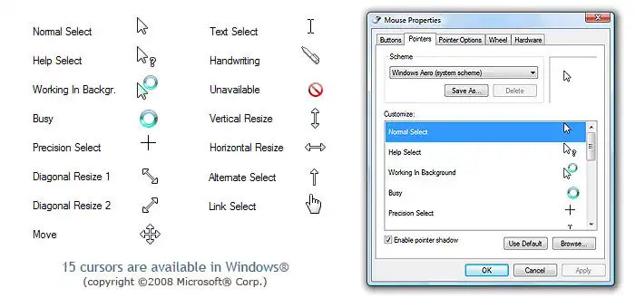

# currust - a cursor converter

[](https://github.com/hachispin/currust/actions/workflows/release.yml)
[](https://crates.io/crates/currust)

A tool written in Rust to convert cursors between Windows and Linux. Specifically,
converting from the CUR/ANI format to the Xcursor format (plus some other features).

## Installation

There are currently two supported methods of installation:

- download the binaries on the [releases page](https://github.com/hachispin/currust/releases/latest) (recommended)
- build from crates with `cargo install currust` (requires `cargo`)

## Usage (automatic)

The primary use-case of this tool is to convert a Windows _cursor theme_ to Linux. A _cursor theme_ is a
directory that contains some cursors, along with an installer file that uses either the INF or CRS format.

If the cursor theme being converted has no such installer file, read the [manual usage section](#usage-manual).

You can convert a cursor theme as such:

```bash
currust ./my-cursor-theme
```

This converts the theme and writes the produced X11 theme (which is a directory) in the current
directory. Add the `--out` (or `-o` for short) argument to place it in the specified path.

```bash
currust ./my-cursor-theme -o ./please/go/here/instead
```

Cursor themes on Windows can be scaled by Windows itself. Unfortunately, this feature doesn't
exist on most Linux distributions, so Xcursor themes have to include their own size variations.

The `--scale-to` argument is available to provide some scale factors, along
with `--scale-with` to provide a scaling algorithm to use (default: Lanczos3).

Note that this increases the size of the resulting cursor theme.

> [!TIP]
> For pixel art cursors, use nearest-neighbour scaling with `--scale-with nearest`. Integer scale factors work best.

```bash
currust ./my-cursor-theme --scale-to 1.5 2 3 --scale-with mitchell
```

Afterwards, move the converted theme to the system-wide `/usr/share/icons` or the local `~/.icons` (recommended).
Anything listed [here](https://specifications.freedesktop.org/icon-theme/latest/#directory_layout) should work.
Switching to this cursor theme depends on your distribution (or more so, your DE), so just (kindly) look it up.

<details>
<summary>Example usage</summary>

```bash
❯ tree  # Expected cursor theme layout (as input)
.
└── [The Herta Cursor ver.2.0.0]
    ├── 01-Normal.ani
    ├── 02-Link.ani
    ├── 03-Loading.ani
    ├── 04-Help.ani
    ├── 05-Text Select Alt.ani
    ├── 05-Text Select.ani
    ├── 06-Handwriting.ani
    ├── 07-Precision.ani
    ├── 08-Unavailable.ani
    ├── 09-Location Select.ani
    ├── 10-Person Select.ani
    ├── 11-Vertical Resize.ani
    ├── 12-Horizontal Resize.ani
    ├── 13-Diagonal Resize 1.ani
    ├── 14-Diagonal Resize 2.ani
    ├── 15-Move.ani
    ├── 16-Alternate Select.ani
    ├── [Changelog].txt
    └── Installer.inf

2 directories, 19 files

❯ currust \[The\ Herta\ Cursor\ ver.2.0.0\] --scale-to 5 --scale-with nearest -o ~/.icons

❯ plasma-apply-cursortheme ~/.icons/The\ Herta\ Cursor\ ver\ 2.0.0 # If you're on KDE
Successfully applied the mouse cursor theme The Herta Cursor ver 2.0.0 to your current Plasma session
```

This creates a cursor theme upscaled to 5x using nearest-neighbour scaling. The original 1x scale
is still included. This may be useful for larger screens, or for my use case, making the enlarged
cursor from KDE's shake cursor effect not look blurry (since the cursor theme is pixel-art).

</details>

## Usage (manual)

The cursor theme being converted may lack an installer file or have one in an unsupported format.
To convert, pass the `--manual` flag, where a guided installation process will occur. Note that as
of now, this configuration isn't saved--this must be done each time the theme is to-be converted.

<details>
<summary>Manual installation</summary>

A prompt will appear for each cursor in the theme that needs to be converted. A checkmark
will appear on cursors you've already selected (though, you can re-select them if needed).

You can move up and down the list using the `j` and `k` keys respectively.

In case the (admittedly rudimentary) emoji/glyph visual representations of
the cursor aren't enough, here's a convenient reference image you can use.



```bash
? Select the file representing 'Hand'.
Description: a hand pointing upwards
Used when: hovering over a link or anything that you can click
Names: link select, link
Looks like: 👆 or  ›
❯ 'Alternate Select.ani'
  'Busy.ani'
  'Diagonal Resize 1.ani'
  'Diagonal Resize 2.ani'
  'Handwriting.ani'
  'Help Select.ani'
  'Horizontal Resize.ani'
  'Link Select.ani'
  'Location Select.ani'
  'Move.ani'
  'Normal Select.ani' ✓
  'Person Select.ani'
  'Precision Select.ani'
  'Text Select 2.ani'
  'Text Select.ani'
  'Unavailable.ani'
  'Vertical Resize.ani'
  'Working In Background.ani'
```

</details>

## About Windows

If you're using Windows, you can still use this. For symlink coverage,
a bash script will be generated for users to run instead.

## Goals

All the baseline goals I had for this project are complete, so this is closer to
a "planned/future features" section. Note that not everything here may be added.

- [x] Publish or otherwise for usage with `cargo` and package managers
- [ ] Replace bash script generation by exporting to tar.gz
- [ ] Conversion from X11 cursors to Windows cursors (i.e, the other way around)
- [ ] [SVG cursor themes](https://blog.vladzahorodnii.com/2024/10/06/svg-cursors-everything-that-you-need-to-know-about-them) for KDE Plasma
- [x] ~~hyprcursor (cursor format for hyprland) support~~
      → covered by [hyprcursor-util](https://github.com/hyprwm/hyprcursor/tree/main/hyprcursor-util)
- [x] Have a guided installation process for themes with no installer file

---

The name ("currust") comes from a portmanteau of "cursor" and "Rust".
